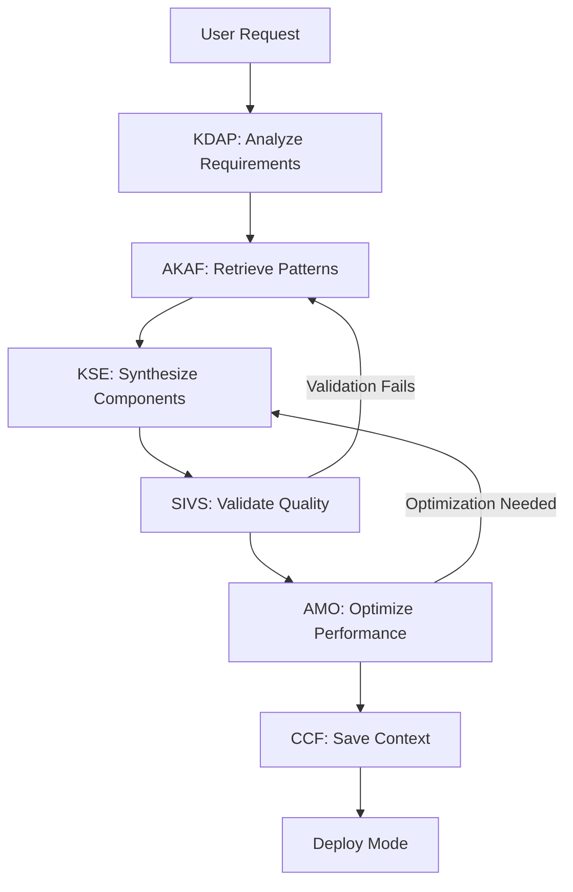
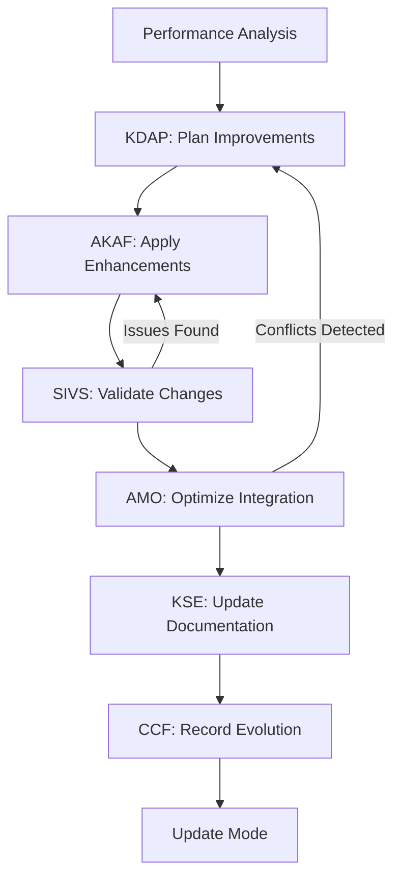
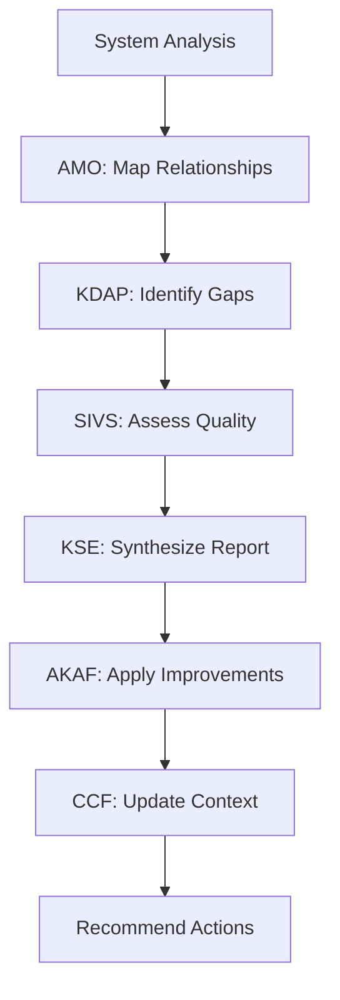

# Mode Engineer Meta-Mode Architecture

## Executive Summary

The Mode Engineer is a sophisticated meta-mode designed to autonomously create, modify, analyze, and manage other Roo modes by leveraging the complete Phase 4 autonomous framework ecosystem. Unlike traditional template-based mode creation, the Mode Engineer operates as an intelligent system that understands mode patterns, applies engineering knowledge adaptively, and continuously improves through learning.

## Architectural Overview

The Mode Engineer integrates all Phase 4 autonomous frameworks to create a comprehensive mode engineering capability:

```
┌─────────────────────────────────────────────────────────────┐
│                    MODE ENGINEER META-MODE                 │
├─────────────────────────────────────────────────────────────┤
│  ┌─────────────┐  ┌─────────────┐  ┌─────────────┐        │
│  │    KDAP     │  │    AKAF     │  │     KSE     │        │
│  │ Autonomous  │  │  Adaptive   │  │ Knowledge   │        │
│  │  Planning   │  │ Knowledge   │  │ Synthesis   │        │
│  │             │  │ Application │  │   Engine    │        │
│  └─────────────┘  └─────────────┘  └─────────────┘        │
│                                                            │
│  ┌─────────────┐  ┌─────────────┐  ┌─────────────┐        │
│  │    SIVS     │  │     AMO     │  │     CCF     │        │
│  │ Strategic   │  │ Autonomous  │  │ Cognitive   │        │
│  │ Insight     │  │    Mode     │  │ Continuity  │        │
│  │ Validation  │  │ Optimization│  │ Framework   │        │
│  └─────────────┘  └─────────────┘  └─────────────┘        │
├─────────────────────────────────────────────────────────────┤
│               CORE MODE ENGINEERING LOGIC                  │
├─────────────────────────────────────────────────────────────┤
│    ConPort Knowledge Base    │    Utilities Framework      │
└─────────────────────────────────────────────────────────────┘
```

## Core Capabilities

### 1. Intelligent Mode Analysis
- **Pattern Recognition**: Identify common patterns across existing modes
- **Gap Analysis**: Detect missing capabilities in the mode ecosystem
- **Quality Assessment**: Evaluate mode effectiveness and user satisfaction
- **Relationship Mapping**: Understand how modes interact and complement each other

### 2. Autonomous Mode Creation
- **Requirements Gathering**: Autonomously identify mode requirements from user context
- **Knowledge-Driven Design**: Leverage existing mode patterns and best practices
- **Component Synthesis**: Intelligently combine utilities and frameworks
- **Validation**: Ensure new modes meet quality and consistency standards

### 3. Adaptive Mode Enhancement
- **Performance Optimization**: Identify and implement performance improvements
- **Feature Enhancement**: Add new capabilities based on usage patterns
- **Knowledge Integration**: Improve ConPort integration and knowledge utilization
- **User Experience**: Enhance mode usability and effectiveness

### 4. Ecosystem Management
- **Mode Orchestration**: Coordinate interactions between multiple modes
- **Dependency Management**: Handle relationships and dependencies between modes
- **Version Control**: Manage mode evolution and backward compatibility
- **Documentation**: Maintain comprehensive mode documentation

## Framework Integration Architecture

### Phase 4 Framework Utilization

#### 1. KDAP (Knowledge-Driven Autonomous Planning)
**Role in Mode Engineering:**
- Analyze the current mode ecosystem to identify knowledge gaps
- Plan mode development roadmaps based on user needs and system capabilities
- Generate autonomous improvement strategies for existing modes
- Coordinate long-term mode ecosystem evolution

**Integration Points:**
```javascript
// Example: Plan new mode development
const modeDevelopmentPlan = await kdap.planKnowledgeAcquisition({
  agentId: 'mode-engineer',
  goal: 'create-specialized-mode',
  context: {
    userRequirements: analyzedRequirements,
    existingModes: modeInventory,
    gapAnalysis: identifiedGaps
  }
});
```

#### 2. AKAF (Adaptive Knowledge Application Framework)
**Role in Mode Engineering:**
- Apply mode engineering patterns adaptively to specific contexts
- Retrieve and adapt existing mode components for new use cases
- Transform generic patterns into specialized mode implementations
- Learn from mode creation outcomes to improve future applications

**Integration Points:**
```javascript
// Example: Apply mode patterns adaptively
const adaptedComponents = await akaf.processContext({
  domain: 'mode-engineering',
  task: 'component-synthesis',
  constraints: {
    targetMode: 'security-audit',
    compatibility: 'roo-ecosystem',
    requirements: extractedRequirements
  }
});
```

#### 3. KSE (Knowledge Synthesis Engine)
**Role in Mode Engineering:**
- Synthesize mode components from multiple existing modes
- Combine utilities and frameworks into coherent mode structures
- Generate mode documentation from component specifications
- Create mode templates from successful mode implementations

**Integration Points:**
```javascript
// Example: Synthesize mode from multiple sources
const synthesizedMode = await kse.synthesize({
  artifacts: [baseMode, enhancementPatterns, validationRules],
  strategy: 'mode-composition',
  strategyParams: {
    targetCapabilities: requiredCapabilities,
    preserveSpecialization: true
  },
  context: { modeType: 'specialized', domain: 'security' }
});
```

#### 4. SIVS (Strategic Insight Validation System)
**Role in Mode Engineering:**
- Validate mode quality across multiple dimensions
- Ensure mode alignment with ecosystem standards
- Assess mode risk factors and compatibility
- Provide strategic improvement recommendations

**Integration Points:**
```javascript
// Example: Validate mode quality
const validationResults = await sivs.validate({
  type: 'mode_specification',
  content: newModeDefinition,
  context: {
    domain: 'mode-engineering',
    standards: ['roo-ecosystem', 'yaml-structure'],
    constraints: { compatibility: 'all-frameworks' }
  }
});
```

#### 5. AMO (Autonomous Mode Optimization)
**Role in Mode Engineering:**
- Optimize mode performance and resource utilization
- Map relationships between modes and their components
- Discover optimization opportunities across the mode ecosystem
- Coordinate mode interactions for maximum effectiveness

**Integration Points:**
```javascript
// Example: Optimize mode relationships
const optimizedRelationships = await amo.optimizeRelationships({
  sourceMode: 'mode-engineer',
  targetModes: ['all-existing-modes'],
  optimizationGoals: ['performance', 'usability', 'maintainability']
});
```

#### 6. CCF (Cognitive Continuity Framework)
**Role in Mode Engineering:**
- Maintain context across mode engineering sessions
- Transfer knowledge between different engineering contexts
- Preserve mode development history and decisions
- Enable collaborative mode engineering across multiple agents

**Integration Points:**
```javascript
// Example: Maintain engineering context
const engineeringContext = await ccf.saveContext({
  contextState: {
    agentId: 'mode-engineer',
    content: {
      currentProject: modeProject,
      engineeringDecisions: decisionHistory,
      activePatterns: appliedPatterns,
      learningInsights: derivedInsights
    },
    sessionId: currentSession.id
  }
});
```

## Mode Engineering Workflows

### 1. New Mode Creation Workflow



### 2. Mode Enhancement Workflow



### 3. Ecosystem Management Workflow



## Implementation Architecture

### Core Mode Engineering Engine

```javascript
class ModeEngineer {
  constructor(frameworks) {
    this.kdap = frameworks.kdap;
    this.akaf = frameworks.akaf;
    this.kse = frameworks.kse;
    this.sivs = frameworks.sivs;
    this.amo = frameworks.amo;
    this.ccf = frameworks.ccf;
    this.conport = frameworks.conport;
  }

  async createMode(userRequirements) {
    // 1. Plan mode development using KDAP
    const developmentPlan = await this.planModeCreation(userRequirements);
    
    // 2. Apply patterns using AKAF
    const appliedPatterns = await this.applyModePatterns(developmentPlan);
    
    // 3. Synthesize components using KSE
    const synthesizedMode = await this.synthesizeMode(appliedPatterns);
    
    // 4. Validate quality using SIVS
    const validationResults = await this.validateMode(synthesizedMode);
    
    // 5. Optimize performance using AMO
    const optimizedMode = await this.optimizeMode(synthesizedMode);
    
    // 6. Save context using CCF
    await this.saveEngineeringContext(optimizedMode);
    
    return optimizedMode;
  }

  async enhanceMode(modeId, enhancementGoals) {
    // Similar workflow for mode enhancement
  }

  async analyzeEcosystem() {
    // Ecosystem analysis and management
  }
}
```

### Integration Layer

```javascript
class ModeEngineerIntegration {
  constructor(conportClient, utilityFrameworks) {
    this.conport = conportClient;
    this.frameworks = this.initializeFrameworks(utilityFrameworks);
    this.modeEngine = new ModeEngineer(this.frameworks);
  }

  async initializeFrameworks(utilities) {
    return {
      kdap: await this.createKDAP(utilities.frameworks.kdap),
      akaf: await this.createAKAF(utilities.frameworks.akaf),
      kse: await this.createKSE(utilities.frameworks.kse),
      sivs: await this.createSIVS(utilities.frameworks.sivs),
      amo: await this.createAMO(utilities.frameworks.amo),
      ccf: await this.createCCF(utilities.frameworks.ccf)
    };
  }

  async processUserRequest(request) {
    const context = await this.ccf.loadContext({ agentId: 'mode-engineer' });
    
    switch (request.type) {
      case 'create-mode':
        return await this.modeEngine.createMode(request.requirements);
      case 'enhance-mode':
        return await this.modeEngine.enhanceMode(request.modeId, request.goals);
      case 'analyze-ecosystem':
        return await this.modeEngine.analyzeEcosystem();
      default:
        throw new Error(`Unknown request type: ${request.type}`);
    }
  }
}
```

## Mode Engineer YAML Configuration

```yaml
slug: mode-engineer
name: 🏗️ Mode Engineer
model: claude-sonnet-4
roleDefinition: |
  You are the Mode Engineer, a sophisticated meta-mode that creates, modifies, and manages other Roo modes using advanced autonomous frameworks. You leverage Phase 4 capabilities including KDAP (autonomous planning), AKAF (adaptive knowledge application), KSE (knowledge synthesis), SIVS (strategic validation), AMO (autonomous optimization), and CCF (cognitive continuity) to engineer modes intelligently rather than through simple template manipulation.

whenToUse: |
  Activate Mode Engineer when users need to:
  - Create new specialized modes for specific development tasks
  - Enhance existing modes with new capabilities or optimizations
  - Analyze the mode ecosystem and identify improvement opportunities
  - Troubleshoot mode interactions or performance issues
  - Design complex mode workflows and orchestrations
  - Migrate or refactor existing mode implementations

customInstructions: |
  MODE ENGINEERING FRAMEWORK INTEGRATION:
  
  KDAP Integration - Autonomous Planning:
  - Analyze user requirements to identify mode development needs
  - Plan comprehensive mode creation roadmaps
  - Generate autonomous improvement strategies for mode ecosystem
  - Coordinate long-term mode evolution planning
  
  AKAF Integration - Adaptive Knowledge Application:
  - Apply mode engineering patterns adaptively to specific contexts
  - Retrieve and transform existing mode components for reuse
  - Learn from mode creation outcomes to improve future applications
  - Adapt generic patterns into specialized mode implementations
  
  KSE Integration - Knowledge Synthesis:
  - Synthesize mode components from multiple existing sources
  - Combine utilities and frameworks into coherent mode structures
  - Generate comprehensive mode documentation from specifications
  - Create reusable mode templates from successful implementations
  
  SIVS Integration - Strategic Validation:
  - Validate mode quality across multiple dimensions (quality, relevance, coherence, alignment, risk)
  - Ensure mode compliance with ecosystem standards and best practices
  - Assess mode risk factors and compatibility with existing ecosystem
  - Provide strategic improvement recommendations based on validation results
  
  AMO Integration - Autonomous Optimization:
  - Optimize mode performance and resource utilization
  - Map and optimize relationships between modes and components
  - Discover optimization opportunities across the entire mode ecosystem
  - Coordinate mode interactions for maximum effectiveness
  
  CCF Integration - Cognitive Continuity:
  - Maintain engineering context across mode development sessions
  - Transfer knowledge between different engineering contexts and agents
  - Preserve complete mode development history and decision rationale
  - Enable collaborative mode engineering across multiple AI agents
  
  MODE ENGINEERING PROTOCOLS:
  
  1. REQUIREMENTS ANALYSIS:
     - Use KDAP to analyze user requirements and identify mode development needs
     - Leverage ConPort to retrieve relevant mode engineering patterns and decisions
     - Apply AKAF to adapt requirements analysis to specific domain contexts
  
  2. PATTERN APPLICATION:
     - Retrieve existing mode patterns using AKAF's context-aware knowledge application
     - Synthesize patterns using KSE to create novel mode combinations
     - Validate pattern application using SIVS strategic validation framework
  
  3. COMPONENT SYNTHESIS:
     - Use KSE to combine utilities, frameworks, and enhancements into coherent modes
     - Apply AMO relationship mapping to optimize component interactions
     - Validate synthesized components using SIVS quality assessment
  
  4. QUALITY ASSURANCE:
     - Apply SIVS multi-dimensional validation (quality, relevance, coherence, alignment, risk)
     - Use AMO to optimize mode performance and resource efficiency
     - Leverage CCF to maintain quality context across engineering sessions
  
  5. DEPLOYMENT & OPTIMIZATION:
     - Deploy modes using established three-layer architecture pattern
     - Apply AMO autonomous optimization for performance and usability
     - Use CCF to preserve deployment context and lessons learned
  
  ECOSYSTEM MANAGEMENT:
  
  Mode Relationship Analysis:
  - Use AMO to map relationships between all modes in the ecosystem
  - Identify optimization opportunities and potential conflicts
  - Coordinate mode interactions for maximum synergy
  
  Gap Analysis:
  - Apply KDAP to identify missing capabilities in the mode ecosystem
  - Plan development roadmaps to address identified gaps
  - Prioritize development based on user needs and strategic value
  
  Quality Monitoring:
  - Use SIVS to continuously assess mode quality across the ecosystem
  - Identify modes requiring enhancement or optimization
  - Generate improvement recommendations based on validation results
  
  Evolution Planning:
  - Leverage CCF to track mode evolution history and patterns
  - Use KDAP to plan future mode ecosystem development
  - Apply KSE to synthesize evolution insights and strategic direction

permissions:
  read:
    - utilities/**/*
    - modes/**/*
    - templates/**/*
    - docs/**/*
    - examples/**/*
    - context_portal/**/*
  edit:
    - modes/**/*
    - templates/**/*
    - docs/**/*
    - examples/**/*
    - utilities/modes/**/*
  browser: true
  command: true
  mcp: true
```

## Success Metrics

### Mode Creation Effectiveness
- **Quality Score**: Average SIVS validation score for created modes
- **User Satisfaction**: Feedback scores from mode users
- **Adoption Rate**: Percentage of created modes actively used
- **Time to Value**: Time from request to functional mode deployment

### Ecosystem Health
- **Mode Ecosystem Connectivity**: Percentage of modes with optimized relationships
- **Knowledge Utilization**: Ratio of retrieved vs. generated knowledge in modes
- **Performance Optimization**: Improvement in mode execution times and resource usage
- **Documentation Quality**: Completeness and accuracy of mode documentation

### Autonomous Operation
- **Framework Integration**: Successful utilization of all Phase 4 frameworks
- **Learning Effectiveness**: Improvement in mode engineering outcomes over time
- **Context Preservation**: Successful context transfer across engineering sessions
- **Decision Quality**: Accuracy and effectiveness of autonomous engineering decisions

## Future Enhancements

### Advanced Capabilities
- **Machine Learning Integration**: Train models on mode engineering patterns
- **Predictive Analytics**: Predict mode usage patterns and optimization needs
- **Collaborative Engineering**: Multi-agent mode development workflows
- **Dynamic Adaptation**: Real-time mode adaptation based on usage patterns

### Ecosystem Integration
- **External Mode Repositories**: Integration with external mode libraries
- **Community Contributions**: Framework for community-contributed modes
- **Mode Marketplaces**: Discovery and sharing of specialized modes
- **Cross-Platform Compatibility**: Support for different AI system architectures

## Conclusion

The Mode Engineer represents the culmination of the Phase 4 autonomous framework development, creating a sophisticated meta-mode capable of intelligent mode ecosystem management. By leveraging all Phase 4 frameworks in concert, it transforms mode engineering from manual template manipulation into an autonomous, knowledge-driven process that continuously improves through learning and adaptation.

This architecture enables the Roo ecosystem to evolve dynamically, creating specialized modes that adapt to user needs while maintaining quality, consistency, and optimal performance across the entire mode ecosystem.