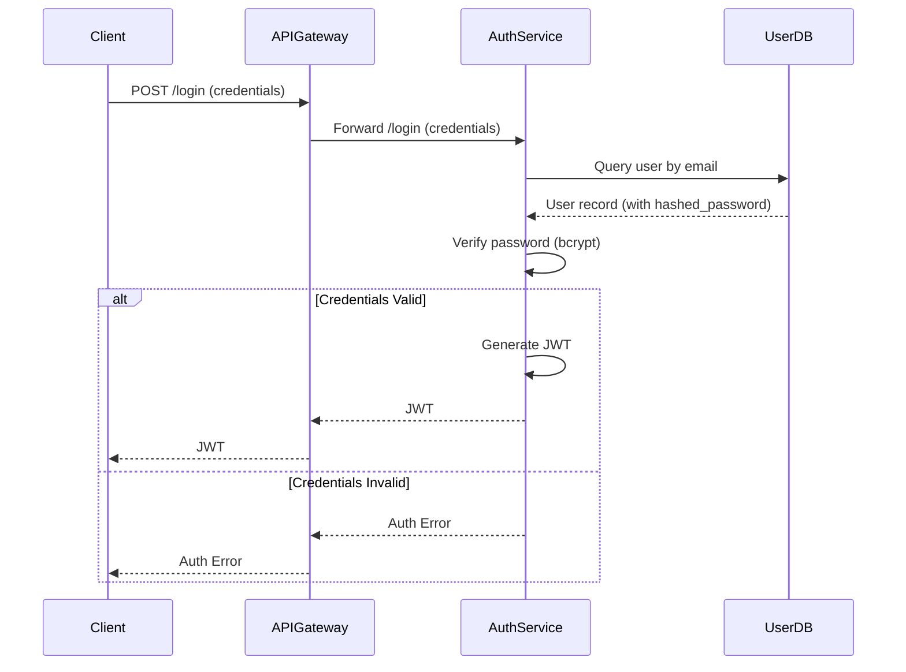

# Examples: Using 'Docs' Mode as a Documentation Creator

This document provides practical examples of how to interact with the `📝 Docs` mode when your goal is to create new documentation. These scenarios illustrate the collaborative workflow and how the mode applies its core principles.

## Example 1: Creating a README for a New Python Library

**Scenario:** You've developed a small Python library called `string-utils` and need a basic README file.

**Your Initial Prompt:**
```
/mode docs
I need to create a README.md for my new Python library called 'string-utils'.
It provides helper functions for common string manipulations like reversing a string and checking if a string is a palindrome.
The target audience is other Python developers.
```

**Mode's Potential Clarification/Scaffolding:**
```
Okay, I can help with that! For a standard Python library README, I suggest the following sections:

1.  **`string-utils`** (Project Title)
2.  **Overview** (Brief description of what it does)
3.  **Features** (List of key functions/capabilities)
4.  **Installation** (How to install, e.g., `pip install string-utils`)
5.  **Usage** (Basic code examples for main functions)
6.  **Contributing** (How others can contribute, if applicable)
7.  **License** (e.g., MIT, Apache 2.0)

Does this structure look good? Do you have a preferred license, or any specific contribution guidelines yet?
```

**Your Response:**
```
Yes, that structure is good. Let's go with an MIT license. No specific contribution guidelines for now, just a general note to open an issue or PR.
For features, it has `reverse_string(s)` and `is_palindrome(s)`.
```

**Mode's Content Generation (Excerpt for 'Usage' section):**
```
Great. Here's a draft for the 'Usage' section. Let me know what you think:

## Usage

Here's how to use the `string-utils` library:

```python
import string_utils

# Reverse a string
text = "hello"
reversed_text = string_utils.reverse_string(text)
print(f"'{text}' reversed is '{reversed_text}'")  # Output: 'hello' reversed is 'olleh'

# Check if a string is a palindrome
word1 = "madam"
word2 = "world"
print(f"Is '{word1}' a palindrome? {string_utils.is_palindrome(word1)}")  # Output: Is 'madam' a palindrome? True
print(f"Is '{word2}' a palindrome? {string_utils.is_palindrome(word2)}")  # Output: Is 'world' a palindrome? False
```

I can continue drafting the other sections based on this.
```

**Interaction Continues:** You would then review, provide feedback, and the mode would refine the content until the README is complete.

## Example 2: Drafting a Tutorial for a Web Application Feature

**Scenario:** You need to create a tutorial for a new "User Profile Update" feature in your web application. The audience is non-technical end-users.

**Your Initial Prompt:**
```
/mode docs
I need to write a tutorial for our web app's new 'User Profile Update' feature.
The audience is our general user base, so it needs to be very simple and step-by-step.
The feature allows users to change their display name, email, and profile picture.
```

**Mode's Potential Clarification/Scaffolding:**
```
Understood. For a user-friendly tutorial, I recommend these steps:

1.  **Title:** How to Update Your Profile
2.  **Introduction:** Briefly explain what they can update and why it's useful.
3.  **Accessing Your Profile:** How to navigate to the profile settings page. (e.g., "Click your avatar in the top-right, then select 'Profile Settings'")
4.  **Updating Your Display Name:** Step-by-step.
5.  **Changing Your Email Address:** Step-by-step, including any verification.
6.  **Uploading a New Profile Picture:** Step-by-step, mentioning any image requirements (size, format).
7.  **Saving Your Changes:** Crucial final step.
8.  **Troubleshooting/FAQ (Optional):** Common issues, like "What if I don't receive the email verification?"

What do you think of this flow? Do you have screenshots or mockups I can refer to for the UI elements?
```

**Your Response:**
```
The flow is perfect. I don't have screenshots yet, but I can describe the UI.
To access, they click their name in the top-right, then 'Edit Profile'.
Each field (Display Name, Email, Profile Picture) has an 'Edit' button next to it.
```

**Mode's Content Generation (Excerpt for 'Updating Your Display Name'):**
```
Okay, here's a draft for the 'Updating Your Display Name' section:

### Updating Your Display Name

Your display name is how other users see you on the platform. Here’s how to change it:

1.  **Navigate to Profile:** If you haven't already, click your name in the top-right corner of the screen and select "Edit Profile" from the dropdown menu.
2.  **Locate Display Name:** On your profile page, find the section labeled "Display Name." You should see your current display name listed there.
3.  **Click 'Edit':** Next to your current display name, click the "Edit" button (it might look like a pencil icon).
4.  **Enter New Name:** A text box will appear. Type your new desired display name into this box.
5.  **Save Change:** Click the "Save" or "Confirm" button next to the text box to update your display name.

Remember to click the main "Save Changes" button at the bottom of the profile page if there is one, to ensure all your profile updates are stored!
```

**Interaction Continues:** You would provide feedback on clarity, accuracy of UI descriptions, and the mode would help refine the language to be as beginner-friendly as possible.

## Example 3: Creating a Conceptual Overview of a Microservice

**Scenario:** You need to explain a new `AuthService` microservice to other developers on your team.

**Your Initial Prompt:**
```
/mode docs
I need to create a conceptual overview document for our new 'AuthService' microservice.
The audience is other developers in the company, some of whom may not be familiar with its internals.
It handles user registration, login (JWT-based), and password reset. It interacts with a User database.
```

**Mode's Potential Clarification/Scaffolding:**
```
Sounds good. For a conceptual overview for developers, I'd suggest covering:

1.  **Introduction:** Purpose of `AuthService`, its role in the broader system.
2.  **Core Responsibilities:**
    *   User Registration
    *   User Login (including JWT generation & validation)
    *   Password Reset Flow
3.  **Key Technologies:** (e.g., Language/Framework, JWT library, Database type)
4.  **High-Level Architecture:** How it interacts with other services (e.g., API Gateway, User DB) and key internal components. A simple diagram might be useful here.
5.  **API Endpoints Overview:** A brief list of major endpoints and their purpose (not full API spec).
6.  **Security Considerations:** Brief notes on important security aspects.

Would you like me to elaborate on any of these sections or suggest a diagram type?
Also, are there any specific design decisions or patterns used in `AuthService` that are important to highlight (e.g., specific OAuth flow, password hashing algorithm)?
```

**Your Response:**
```
This outline is great. For technologies: Node.js with Express, uses `jsonwebtoken` library, and PostgreSQL for User DB.
It uses bcrypt for password hashing. A simple sequence diagram for the login flow would be helpful.
```

**Mode's Content Generation (Excerpt for 'User Login' and diagram suggestion):**
```
Okay, here's a draft for the 'User Login' part of 'Core Responsibilities', and a suggestion for the sequence diagram:

#### User Login

The `AuthService` handles user authentication. The typical login flow is as follows:
1.  The client application sends user credentials (e.g., email and password) to the `AuthService`'s `/login` endpoint.
2.  `AuthService` retrieves the user record from the User Database based on the provided email.
3.  It verifies the provided password against the stored hashed password using `bcrypt`.
4.  If credentials are valid, `AuthService` generates a JSON Web Token (JWT) containing user identifiers and permissions.
5.  The JWT is returned to the client. The client then includes this JWT in the `Authorization` header for subsequent requests to other services.

**Login Flow Sequence Diagram Suggestion:**

I can help you generate a textual representation for a sequence diagram (e.g., using Mermaid syntax) if you'd like. It would look something like this:


Would you like me to proceed with generating this Mermaid diagram code, or refine the text description further?
```

**Interaction Continues:** You would discuss the diagram, refine the textual descriptions, and ensure all key conceptual aspects of the `AuthService` are covered accurately for the developer audience.

These examples demonstrate how the `📝 Docs` mode can be a powerful partner in creating various types of documentation by understanding your intent, suggesting structures, drafting content, and iteratively refining it based on your feedback.